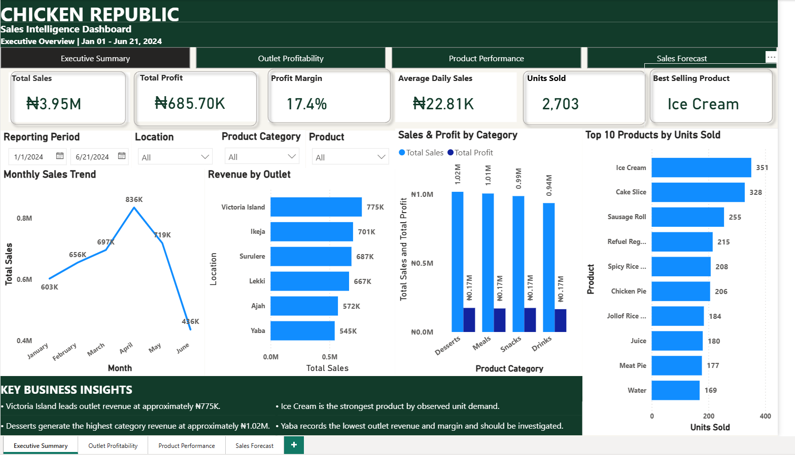
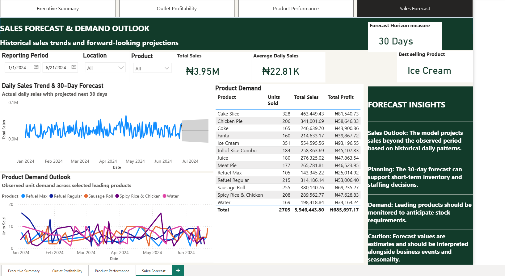
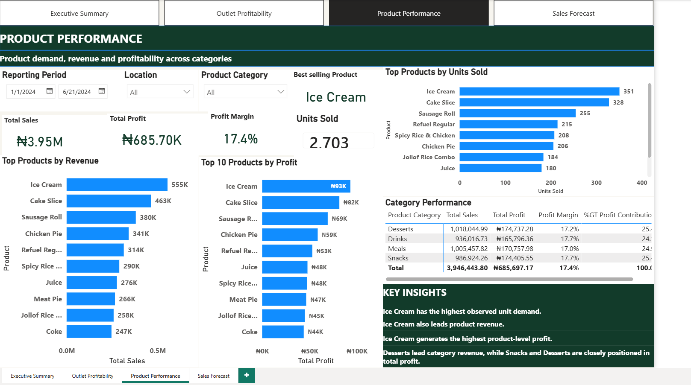
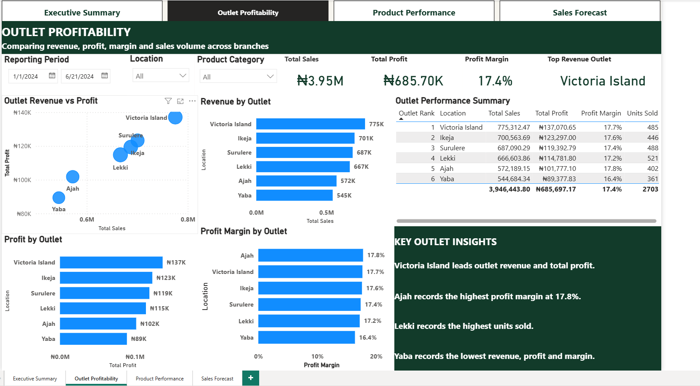

# 🍗 Chicken Republic Sales Analysis

## 📊 Project Overview

This is an independent data analytics portfolio project developed to explore sales performance using a Chicken Republic sales dataset.

The project focuses on transforming raw sales data into actionable business insights through data cleaning, exploratory analysis, data modelling, DAX calculations, and interactive Power BI visualizations.

The analysis examines overall sales performance, outlet profitability, product performance, and future sales demand using a 30-day forecast.

> **Note:** This is an independent portfolio project and was not commissioned by or conducted on behalf of Chicken Republic management.

---

## ⭐ Project Highlights

- 💰 **₦3.95M** in total observed sales
- 📈 **₦685.70K** in total profit
- 🎯 **17.4%** overall profit margin
- 🛒 **2,703** units sold
- 🍦 **Ice Cream** recorded the highest observed unit demand and product revenue
- 🏪 **Victoria Island** generated the highest outlet revenue and total profit
- 📊 **Ajah** recorded the highest outlet profit margin at **17.8%**
- 🔮 Developed a **30-day sales forecast** to support short-term planning
- 📑 Built an interactive **4-page Power BI dashboard** covering executive performance, outlet profitability, product performance and sales forecasting

---
  
## 🎯 Business Objectives

The analysis was designed to answer key business questions including:

- How is overall sales and profit performance?
- Which outlets generate the highest revenue and profit?
- Which outlets have the strongest and weakest profit margins?
- Which products contribute most to sales and profit?
- Which products have the highest unit demand?
- How do different product categories perform?
- What does the short-term sales outlook suggest?
- What business actions could improve performance?

---

## 🛠️ Tools & Technologies

- **Microsoft Excel** — Data preparation and cleaning
- **Python** — Exploratory data analysis
- **Pandas** — Data manipulation and analysis
- **Power Query** — Data transformation
- **Power BI** — Data modelling, visualization and dashboard development
- **DAX** — KPI and analytical calculations

---

## 🔄 Data Analysis Process

The project followed a structured analytics workflow:

### 1. Data Preparation
- Reviewed the raw sales dataset
- Identified and addressed data quality issues
- Cleaned and structured the dataset for analysis

### 2. Exploratory Analysis
- Examined sales and product patterns
- Analysed outlet performance
- Evaluated product and category contribution

### 3. Data Modelling
- Built the analytical model in Power BI
- Created relationships and calculated measures
- Developed business-focused KPIs

### 4. Dashboard Development
Created an interactive Power BI dashboard consisting of four analytical pages:

1. Executive Summary
2. Outlet Profitability
3. Product Performance
4. Sales Forecast

### 5. Business Storytelling
Translated the analytical findings into business insights and recommendations to support decision-making.

---

# 📈 Dashboard

## Executive Summary

Provides an overview of sales, profit, margin, units sold, monthly trends, outlet revenue and product performance.



---

## Outlet Profitability

Compares revenue, profit, profit margin and sales volume across outlets.



---

## Product Performance

Examines product demand, revenue, profit and category performance.



---

## Sales Forecast

Provides a forward-looking view of sales based on historical daily sales patterns and a 30-day forecast horizon.



---

# 📌 Key Performance Indicators

| KPI | Result |
|---|---:|
| Total Sales | ₦3.95M |
| Total Profit | ₦685.70K |
| Profit Margin | 17.4% |
| Units Sold | 2,703 |
| Average Daily Sales | ₦22.81K |
| Best-Selling Product | Ice Cream |

---

# 🔍 Key Business Insights

### 🏪 Outlet Performance

- **Victoria Island** generated the highest outlet revenue at approximately **₦775K** and also recorded the highest total profit.
- **Ajah** recorded the highest profit margin at approximately **17.8%**.
- **Lekki** recorded the highest units sold among the outlets.
- **Yaba** recorded the lowest revenue, profit and profit margin, indicating an area that may require further investigation.

### 🍦 Product Performance

- **Ice Cream** recorded the highest observed unit demand with **351 units sold**.
- Ice Cream also generated the highest product revenue at approximately **₦555K**.
- Ice Cream recorded the highest product-level profit at approximately **₦93K**.
- **Cake Slice** ranked second in unit demand and revenue.

### 🍽️ Category Performance

- **Desserts** generated the highest category revenue at approximately **₦1.02M**.
- Desserts also contributed strongly to overall profit.
- Profit margins across the major categories were relatively close, indicating broadly consistent profitability.

### 📈 Sales Outlook

- Historical daily sales patterns were used to generate a **30-day forward sales forecast**.
- The forecast can support short-term planning around inventory and staffing.
- Forecast estimates should be interpreted alongside seasonality, promotions, operational changes and other business events.

---

# 💡 Business Recommendations

Based on the analysis, the following actions could be considered:

### 1. Investigate Yaba Outlet Performance
Review operational factors, customer traffic, product mix and local demand to understand why Yaba underperforms other outlets.

### 2. Leverage High-Performing Products
Maintain adequate stock levels for high-demand products such as Ice Cream and Cake Slice to reduce potential stock-outs.

### 3. Learn From High-Performing Outlets
Identify operational and sales practices contributing to Victoria Island's strong performance and assess whether successful practices can be replicated across lower-performing outlets.

### 4. Optimize Product Mix
Use product-level revenue, profit and demand data to prioritize products that generate strong financial contribution.

### 5. Use Forecasting for Short-Term Planning
Use the 30-day sales outlook as one input for inventory and staffing decisions while considering seasonal and operational factors.

---

# 📁 Project Structure

```text
chicken-republic-sales-analysis/
│
├── Dashboard/
│   ├── Executive_Summary.png
│   ├── Outlet_Profitability.png
│   ├── Product_Performance.png
│   └── Sales_Forecast.png
│
├── Data/
│   └── Chicken_Republic_Cleaned_Sales.xlsx
│
├── PowerBI/
│   └── Chicken_Republic_Sales_Dashboard.pbix
│
├── Python/
│   └── Chicken_Republic_Sales_Analysis.ipynb
│
└── README.md
```

# 🧠 Skills Demonstrated

- Data Cleaning
- Data Transformation
- Exploratory Data Analysis
- Data Modelling
- DAX
- Power Query
- Python
- Pandas
- Microsoft Excel
- Power BI
- Dashboard Development
- KPI Development
- Business Intelligence
- Data Visualization
- Business Storytelling
- Analytical Thinking
- Business Recommendations
---

# 📂 Project Files

| Folder | Description |
|---|---|
| `Dashboard` | Dashboard screenshots for portfolio viewing |
| `Data` | Cleaned dataset used for analysis |
| `PowerBI` | Interactive Power BI dashboard |
| `Python` | Python exploratory analysis notebook |
---

## 👩🏽‍💻 About This Project

This project was independently developed as part of my data analytics portfolio to demonstrate the practical application of data analysis and business intelligence skills.

The project combines data preparation, analytical techniques and interactive visualization to turn sales data into insights that can support business decision-making.
